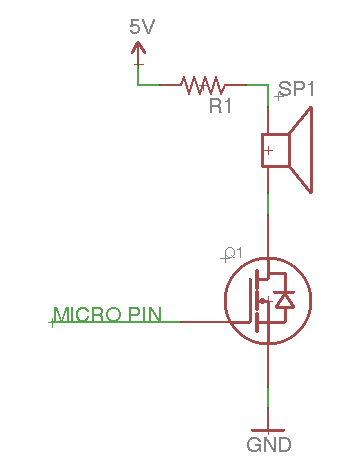
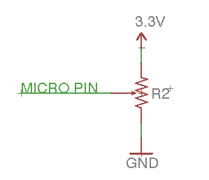
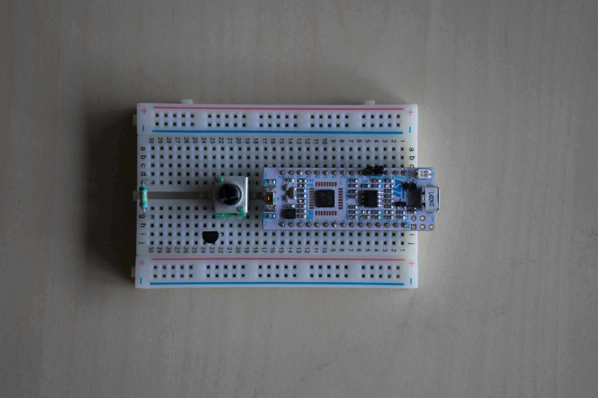
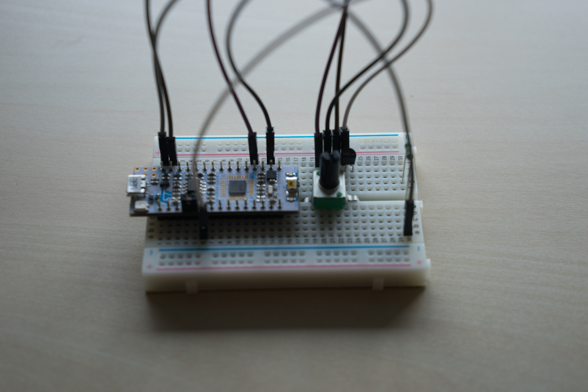
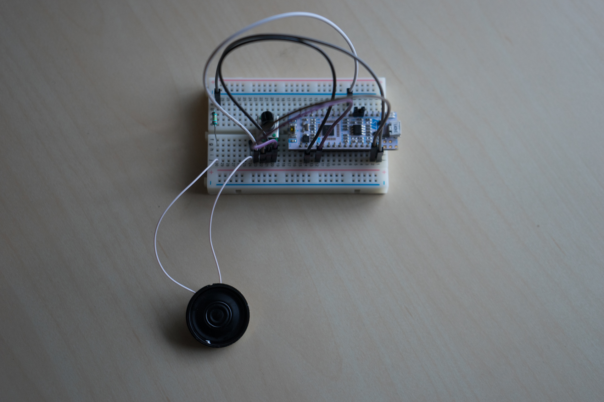
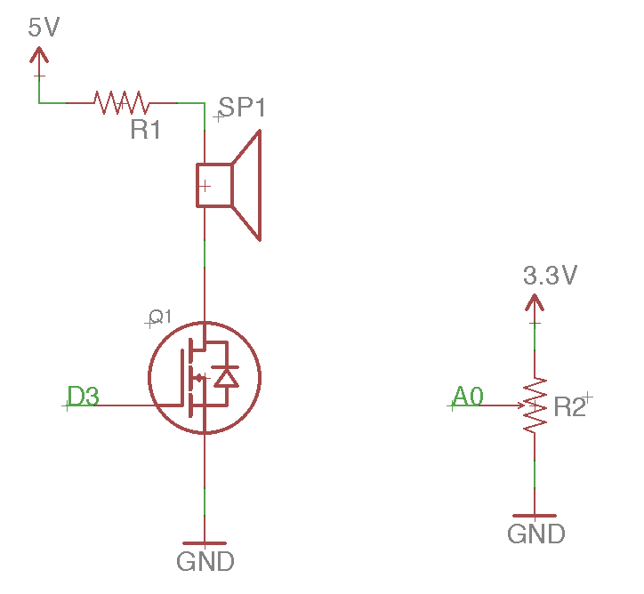

# Building a Programmable Synth for $20

For [Moogfest](http://www.moogfest.com/) this year, Smashing Boxes will be hosting a VIP reception
featuring some innovative projects we have done in the areas of digital art, machine learning, and
data visualization. We want to do more than just show however; we wanted to give participants
something that they could go home and hack on as well. Our goal was to put together a small kit of
electronics that would allow VIP festival-goers to build their own programmable synthesizer. We are
not associated with any of the products discussed in this post; we simply wanted to put together
a kit that could be functional for around $20, including prototyping materials like a breadboard
and wires.

This guide will walk through all the parts needed, the theory behind how this project works, and
finally how to assemble the parts, and how to write software that controls it.


## The Parts

- We picked the [Nucleo-L432KC](https://developer.mbed.org/platforms/ST-Nucleo-L432KC/) as the
  centerpiece of our synthesizer because it delivers tons of potential at a great price. This article
  will detail a simple square wave synth, but this little kit has 9 analog inputs and 2 analog
  outputs that could be used to do all kinds of things. Some other nice features are the expansive
  memory (256kB Flash, 64k RAM) and the True Random Number Generator, which could be particularly
  fun when working with music. Price: $11.
- We picked [a simple 0.5W speaker from Adafruit](https://www.adafruit.com/product/1890) as the
  output for our synthesizer. Also needed was a
  [resistor](https://www.digikey.com/product-detail/en/vishay-bc-components/SFR2500002439FR500/PPC24.3YCT-ND/596973)
  in order to limit the power being sent into the speaker since hooking this up to the USB's 5V
  power line would be too much. Price: $1.50
- In order to deliver power to the speaker, we are using a
  [simple N-channel MOSFET (2N7000)](https://www.onsemi.com/pub/Collateral/2N7000-D.PDF)
  to switch on and off the full power to the speaker. This is a simple and cheap circuit, but only
  allows two states: on and off. This means that we can only use square waves to drive our speaker.
  Price: $0.38
- We also need a way to power and connect all this stuff. For prototyping, we bought a simple
  [400 connection breadboard](https://www.digikey.com/product-detail/en/bud-industries/BB-32621/377-2094-ND/4156445)
  and a
  [40-wire cable with male/male connectors](https://www.digikey.com/product-detail/en/adafruit-industries-llc/758/1528-1154-ND/5353614).
  If you don't have a USB B-micro connector, you will
  [also need to buy one](https://www.digikey.com/product-detail/en/qualtek/3025010-03/Q853-ND/4341883)
  since the Nucleo kits do not include them.
- The complete parts list with links to Digikey for ordering can be found on our
  [moogfest-2017](https://github.com/smashingboxes/moogfest-2017/blob/master/assets/parts.csv)
  repository on Github. Total cost for one kit: **$21.26**


## Circuit Theory

First we'll take a look at a few of the circuits that make this synthesizer work. If theory isn't
your thing, you can skip this section and jump right into the build.


### Transistor Switched Speaker

In order for a speaker to produce sound, it needs to be fed a signal that causes the cone to move
back and forth. This is typically done by producing a very weak signal, like one coming from a
microphone or guitar, and putting it through an amplifier.

For our cheap version, we will be using a transistor to simply switch the speaker on and off. A
transistor is a voltage controlled switch; it allows us to turn on and off a high current circuit
(like a speaker) using a low current circuit (like a microcontroller pin).



When the microcontroller pin goes high, the speaker circuit turns on, sending current through the
speaker and causing the cone to move. When the pin goes low, the circuit is shut off and the cone
moves back. These movements produce sound! The big limitation of this circuit, however, is that the
signal is either all on or all off (digital), meaning it will only create a square wave.

You may also notice that there is a resistor in the picture. The speaker that we chose is rated at
0.5W, and has an impedance of 8 ohms. Power is calculated as:

`P = IV = V^2 / R`

For `V = 5V; R = 8 Ohm`, the power calculates out to 3.125W! In order to make sure that the speaker
doesn't burn out, we need to add a current limiting resistor. Since we cannot change the impedance
of the speaker, we need to change the input voltage by using a simple voltage divider. Using the
formula above by instead solving for V by assuming `R = 8 Ohm, P = 0.5W`, we find that the max
voltage for the speaker is `2V`. We can finally calculate the resistance needed using:

`2V = 5V * 8 Ohm / (R1 + 8 Ohm)`

Solving this, we find that we need at least a 12 Ohm resistor to not burn out our speaker. For this
kit, we chose 24 Ohm just to be safe.

If you are interested in making a circuit that can do more than just square waves, check out the
`Using Analog Outputs` section in `Where to Go From Here` below!


### Potentiometer Dial

The potentiometer circuit we will be using is much simpler. A potentiometer is simply a resistor
with a third connection (the wiper) that can be moved around using a physical dial. We will be using
the potentiometer to create a signal between 3.3V and GND that the user can control using the dial.



When the dial is turned all the way in one direction, the wiper will be connected to the 3.3V line.
When you turn is all the way in the other direction, the wiper will be connected to ground. Anywhere
in between it will be at some voltage in between 3.3V and ground. By connecting the wiper to an
analog input on your microcontroller, you can get a reading of where the dial is currently at.


## Building your Synthesizer

If you haven't used a breadboard before, check out
[this tutorial](https://computers.tutsplus.com/tutorials/how-to-use-a-breadboard-and-build-a-led-circuit--mac-54746)
which goes through the basics of how the breadboard is internally connected. This guide will
use the notation `letter:number` to denote the row and column that the wires or parts should be
placed in. These letters and numbers are marked on the board suggested in the parts above.


### Lay out the Parts

Let's start by laying out where all the components will go. Start by connecting the Nucleo board to
the top of the breadboard so that pin `D1/TX` is connected to `d:1` and `VIN` is connected to `h:1`.
Connect the resistor to the very bottom of the board: `e:30` and `f:30`. The potentiometer will be
connected to `g:20,21,22` with its side legs set in the groove in the middle of the breadboard. The
transistor should be connected to `j:22,23,24`. The transistor should have its flat side facing the
center of the breadboard.




### Wire The Potentiometer

To wire the potentiometer, connect the following pins:
- Potentiometer Pin 1 `i:20` to the microcontroller's 3.3V line, `j:14`.
- Potentiometer Pin 2 `i:21` to the microcontroller's A0 input, `j:12`.
- Potentiometer Pin 3 `i:22` to the microcontroller's GND pin, `j:2`.




### Wire The Transistor

Finally, lets wire the speaker and transistor up.
- One `speaker cable` to the source of the MOSFET, `i:23`.
- One `speaker cable` to one side of the resistor, `j:30`.
- The 5V line `i:4` to the other side of the resistor, `a:30`.



Note: there is an error in this picture. Instead of `a:30` being tied to the 5V line, it is tied to
`Vin`. Please connect `a:30` to `j:4`, not `j:1` as depicted in the picture.


### Ready To Program

The final wiring diagram should look like the following:



Once these are all connected, your breadboard is ready to be programmed. Check out the sections
below to start programming your board, or alternatively, check out our
[moogfest-2017](https://github.com/smashingboxes/moogfest-2017) repo for some stock programs to test
that your board is working!


## Programming Your Synthesizer

In addition to the hardware specs and costs, we also chose the Nucleo board because it can be easily
programmed using [mbed.org](https://developer.mbed.org/). Mbed is an online IDE that allows you to
compile your code remotely, download it, and then drag and drop it into the microcontroller's
memory. If you want more information about the platform, we recommend mbed's
[getting started guide](https://developer.mbed.org/getting-started/).

As was mentioned in the beginning, we need to be able to do two things: output a square wave, and
read the position of the potentiometer. The mbed platform makes both of these tasks easy. The code
to create a square wave is simply:

```
// Create an instance of a PWM object
PwmOut my_pwm(pin_number);

// Set the period, or time between cycles, to (1.0 / FREQ).
my_pwm.period(1.0/440);

// Set the duty cycle, or amount of time at the top of the
// square versus the bottom of the square, to 0.5 (50%).
// This will start the note.
my_pwm.write(0.5);
```

Likewise, the code to read an analog input is:

```
// Create an instance of an Analog input
AnalogIn potentiometer(A0);

// To read the input, simply call the read() function.
float reading_1 = potentiometer.read();

// This does the same thing, but has a shorter notation.
float reading_2 = potentiometer;       
```

That is pretty much all you need! Creating a basic synthesizer could be as simple as:

```
// Loop forever, letting the potentiometer sweep between three octaves of C.
my_pwm.write(0.5);
while(1) my_pwm.period(1 / (220 + 1540 * potentiometer));
```

The demo that we made outputs the [Giorgio Morodor](https://www.youtube.com/watch?v=zhl-Cs1-sG4)
rhythm from Daft Punk's Random Access Memories, using the potentiometer to pitch shift. There are a
couple of helper functions that allow you to call notes by name instead of frequency and to keep
basic tempo.

The code for this can be found [here](https://github.com/smashingboxes/moogfest-2017/blob/master/giorgio/main.cpp).
If you just want to program your controller and go, you can download the compiled version:
[giorgio.bin](https://github.com/smashingboxes/moogfest-2017/blob/master/assets/giorgio.bin). To
use this, start by plugging your Nucleo in to enumerate it as a flash drive. Simply drag-and-drop this
file onto the Nucleo and it will reprogram itself and start running this program.


## Where To Go From Here


### Adding Buttons, Switches, and Dials

- **Buttons** can be read using `DigitalIn`, and are read into the chip as `0` or `1`. If you want
- **Switches** work the same as buttons, except that they stay in the position that they are closed.
  They are read using the same mechanisms, and for synths are useful for settings that will not
  change.
- **Potentiometers** have already been covered above, but there are plenty more inputs! Remember
  that potentiometers are good for creating signals between some min and max value.
- **Rotary Encoders** are dials like a potentiometer, but instead of having a min and max value,
  they output a signal only when they are turned. These are good for selecting one item in a list
  of discrete items.


### Using Analog Inputs

In this example, we used one of the 9 analog inputs to read in the signal from a potentiometer.
Analog inputs can be used for so much more, from reading temperature sensors to reading inputs from
your other synthesizer components. We recommend checking out [sparkfun.com](https://www.sparkfun.com)
or [adafruit.com](https://www.adafruit.com) for more easy to use, well-documented components.


### Using Analog Outputs

Square waves are great, but there are so many other waves that can completely change the sound of
the synth. As mentioned before, there are 2 digital-to-analog outputs, or DACs, that allow us to
send an analog signal out of our chip. This opens the door to all kinds of other waves that are
common in synths, such as [sine waves and sawtooth waves](https://www.youtube.com/watch?v=j2uB4nKzGlg)
Since the transistor circuit is on-off only, we will have to use one or the two following methods
to use the DACS.

1. Output the signal at line-level and use headphones or other speakers. This is the more modular
   and simple approach since it just requires some passive components and can connect to far more.
   This can be achieved with a couple of passive components, or by using a pre-driver meant for this
   application (like the one seen in the
   [STM32F4 Discovery board](http://www.st.com/resource/en/schematic_pack/stm32f4discovery_sch.zip)).

1. Use a signal amplifier to drive our speaker. This allows us to use a chip to amplify any signal,
   not just a square wave. It will require more than just passive components, but you can use the
   speaker above or another, larger speaker. A good example of a chip that lets you do this is the
   [LM386](http://www.ti.com/lit/ds/symlink/lm386.pdf), but there are countless others to choose
   from.

---

Hopefully this covers everything you need to know in order to build your own programmable synth.
If you have any problems with setting things up, we've set up an email that you can use to ask
questions: [synth-help@smashingboxes.com](mailto:synth-help@smashingboxes.com).

The reason we are hosting this event is to highlight the projects that have spun out of Smashing
Labs, including this synth kit.
